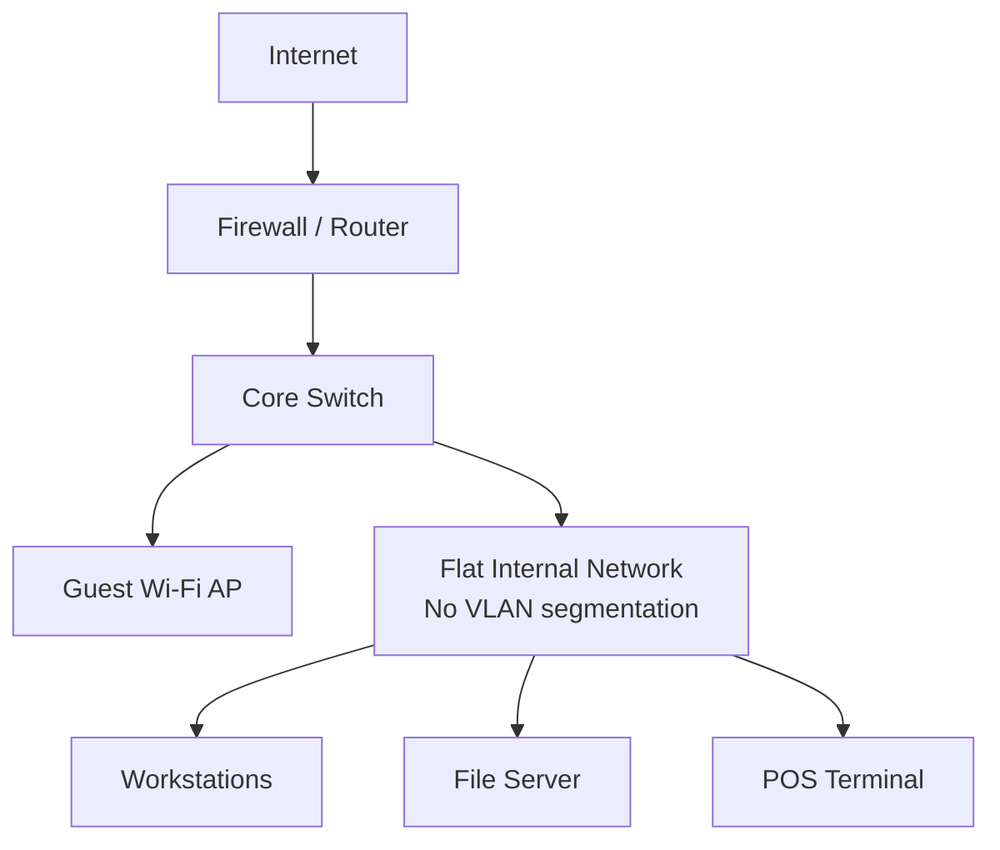

# Network Structure & Security Analysis

# Network Traffic Analysis — Cybersecurity Incident Report

## What's this?

This is a cybersecurity incident report I completed as part of the Google 
Cybersecurity Professional Certificate. The activity involved analyzing 
tcpdump network logs to identify which protocols were affected during a 
real-world style security incident.

**Protocols involved:** UDP, ICMP, DNS  
**Tools used:** tcpdump or a network protocol analyzer

---

## Scenario Summary

A client company's website (www.yummyrecipesforme.com) went down and customers 
were getting a "destination port unreachable" error. As the cybersecurity analyst 
on the case, I used tcpdump to capture and analyze the network traffic to figure 
out what was going on.

---

## Part 1: Provide a summary of the problem found in the DNS and ICMP traffic log

The UDP protocol reveals that the browser wasn't able to reach the DNS server at 203.0.113.2 on port 53. This is based on the results of the network analysis, which show that the ICMP echo reply returned the error message "udp port 53 unreachable." The port noted in the error message is used for DNS service, which is basically what translates domain names like www.yummyrecipesforme.com into IP addresses so the browser knows where to go. The most likely issue is that the DNS service on port 53 either crashed or got blocked somehow, which meant no DNS lookups could go through and the website became completely inaccessible to everyone trying to visit it.

---

## Part 2: Explain your analysis of the data and provide at least one cause of the incident

The incident occurred at 1:24 PM (13:24:32) when multiple customers started reporting that they couldn't access www.yummyrecipesforme.com and kept getting a "destination port unreachable" error. The IT team became aware of the incident through those customer reports and confirmed it when the analyst tried visiting the website themselves and got the exact same error. To investigate, the IT department loaded up tcpdump to capture and analyze the network traffic while attempting to access the site. What they found was that every UDP packet sent to the DNS server at 203.0.113.2 on port 53 kept coming back with an ICMP error message saying "udp port 53 unreachable" and this happened three times consistently in the logs, so it wasn't just a random one-time glitch. The most likely cause of the incident is that the DNS service on the server crashed or stopped running completely, which left port 53 with nothing listening on it. Another possibility is that a firewall rule got changed and started blocking incoming traffic on port 53, which would have the same effect.

## Network Architecture — Hypothetical Small Business Assessment

**What's this?**

A network architecture review I did on a hypothetical small retail business, looking at how the network is laid out and where the security gaps are. This is a different angle from the incident reports above — instead of analyzing an attack after the fact, this looks at the structure itself and flags risks before they get exploited.

**Scenario**

A small retail business ("GreenLeaf Retail") with a handful of employee workstations, a file server, a POS system for card payments, and guest Wi-Fi for customers. All of it sits behind a single firewall/router and one switch.

**Findings**

1. **No network segmentation.** Workstations, the file server, and the POS terminal are all on the same flat network. If one device gets compromised, an attacker can reach everything else on it.
2. **Guest Wi-Fi shares the same LAN.** Customer phones connecting to guest Wi-Fi are one hop away from the file server and POS system. Guest traffic should be on its own isolated VLAN with no route to internal resources.
3. **POS terminal isn't isolated.** This is also a compliance problem — PCI-DSS requires the cardholder data environment to be segmented from the rest of the network.
4. **Single layer of defense.** One firewall at the perimeter and nothing internal means no defense-in-depth. If the perimeter's bypassed, there's nothing else in the way.
5. **No internal monitoring mentioned.** No IDS/IPS or logging on the switch, so an attacker moving laterally inside the LAN wouldn't be caught.

**Recommended fixes**

- Split the network into VLANs: one for workstations, one for the file server, one for the POS system, one for guest Wi-Fi.
- Firewall rules between VLANs so guest traffic can't reach internal systems at all.
- Put the POS terminal on its own isolated segment to meet PCI-DSS requirements.
- Add basic internal monitoring (even a lightweight IDS) to catch lateral movement.

*Home lab version of this analysis (based on my actual VirtualBox/Kali setup) — coming next.*
